# VTOL Tilt-Rotor UAV

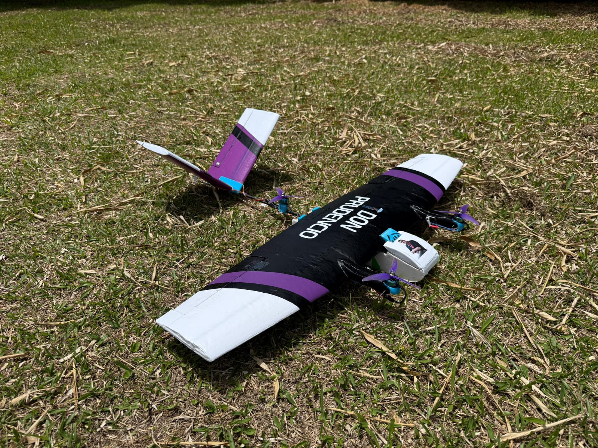

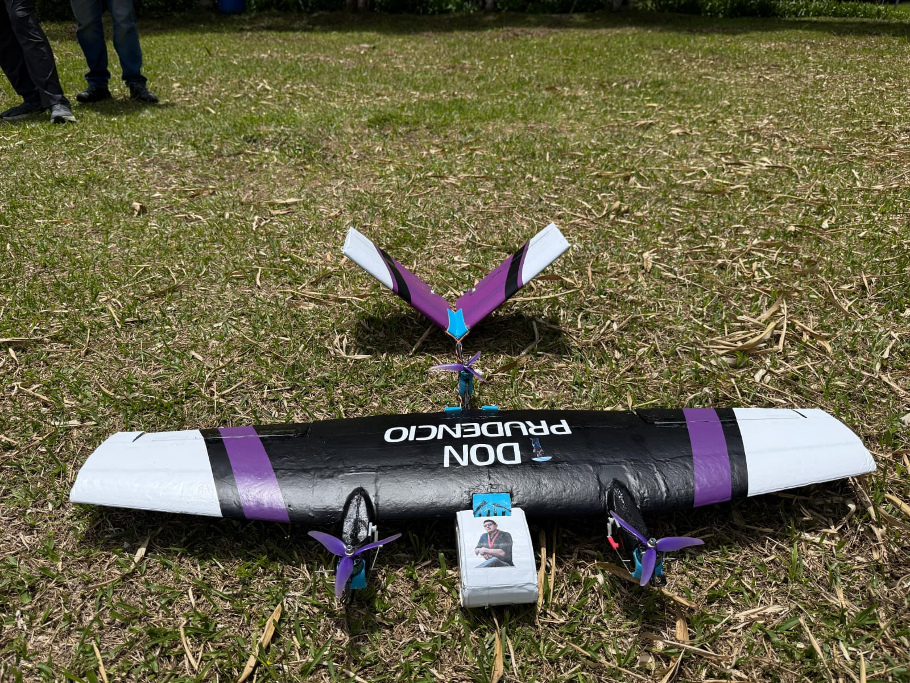

> Design, development, integration, and flight testing of a tricopter VTOL UAV featuring two front tilt-rotors.

## Project Overview

This project involved the design and development of a VTOL UAV capable of both vertical takeoff and landing and forward flight as part of a 5 member team for a university class project. The aircraft was developed as a tricopter configuration with two front tilt-rotors, combining multirotor VTOL capability with fixed-wing forward flight.

The project was developed as a team, covering aerodynamic analysis, structural and mechanical design, electronics integration, flight-control configuration, manufacturing, and flight testing.

## My Role

I served as the **Project Lead**, coordinating the technical development and overall progress of the project.

My main responsibilities included:

- Leading and coordinating the project team and delegating technical tasks.
- Designing the aircraft structure and mechanical assemblies in CAD.
- Supporting aerodynamic analysis using XFLR5.
- Coordinating component selection, system integration, and project resources.
- Integrating the flight controller, propulsion system, servos, and other onboard electronics.
- Configuring the flight controller using INAV.
- Organizing the project budget and development activities.
- Supporting flight testing, troubleshooting, and iterative design improvements.

## Aircraft Configuration

| System | Configuration |
|---|---|
| Configuration | Tricopter VTOL |
| Tilt Mechanism | Two front tilt-rotors |
| Flight Controller | SpeedyBee F405 Wing |
| Flight Control Software | INAV |
| Propulsion | Electric drone motors |
| Actuation | Digital servos |
| Battery | LiPo |
| Aerodynamic Analysis | XFLR5 |

## Manufacturing

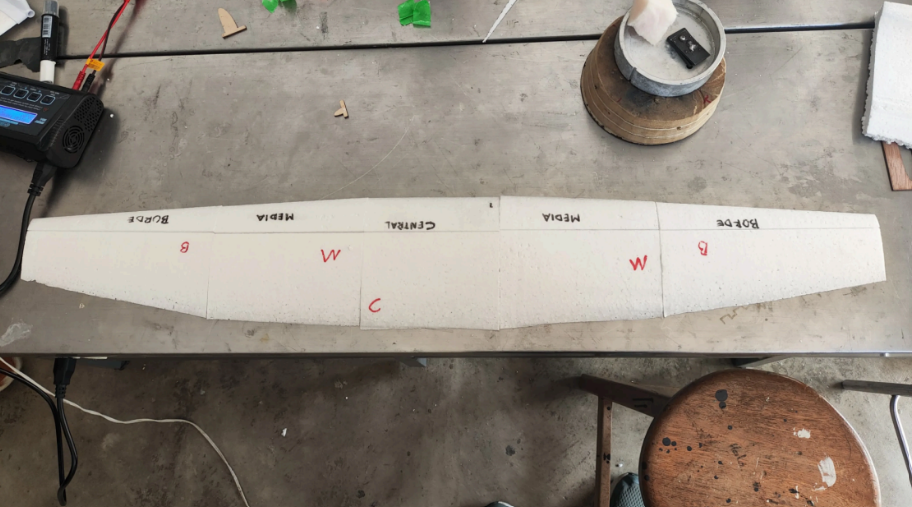
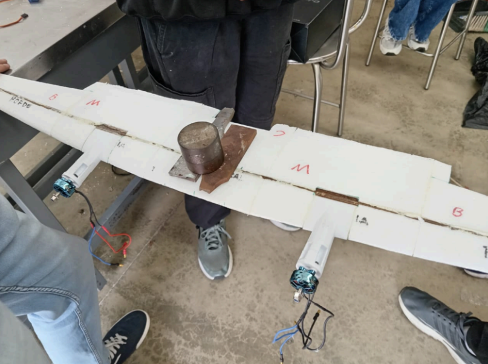
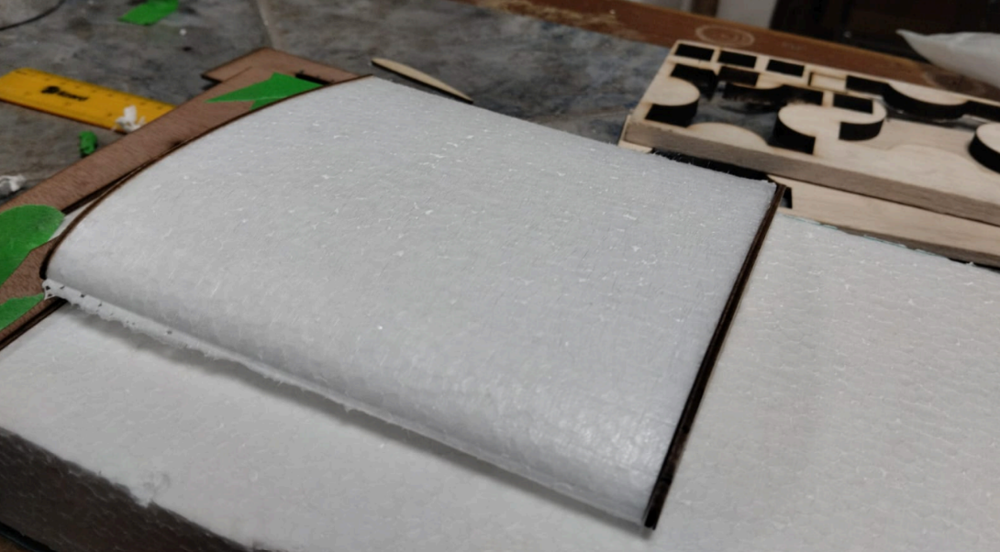

## Computer Aided Design

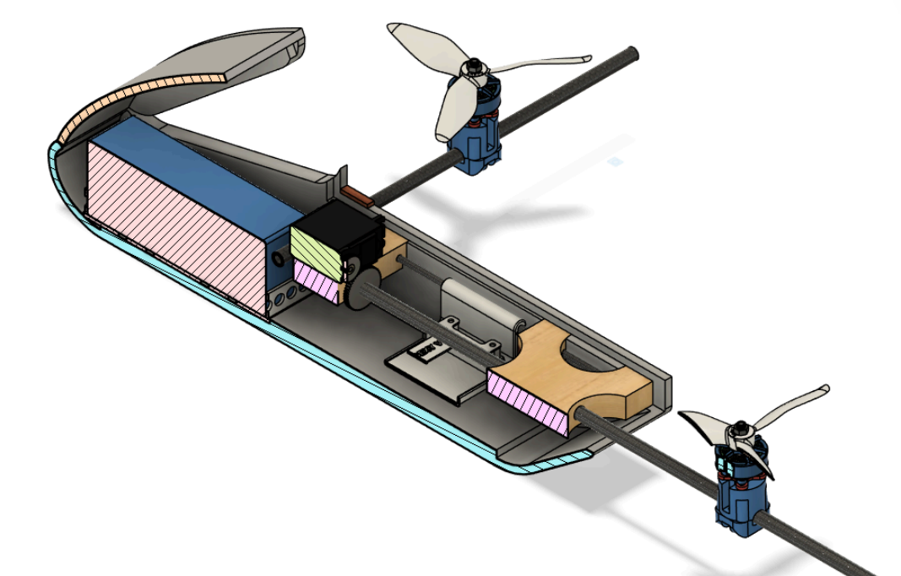
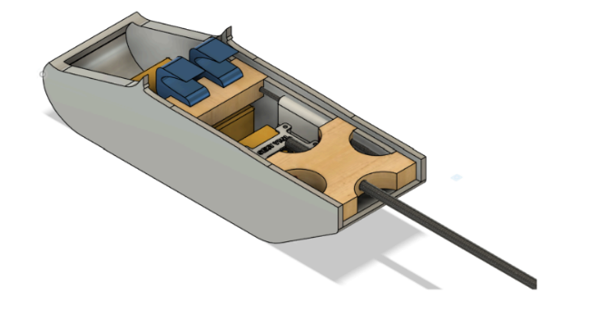
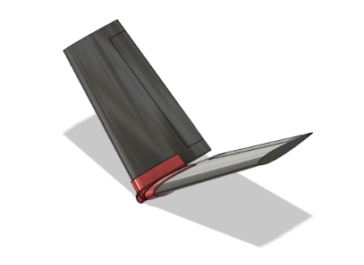
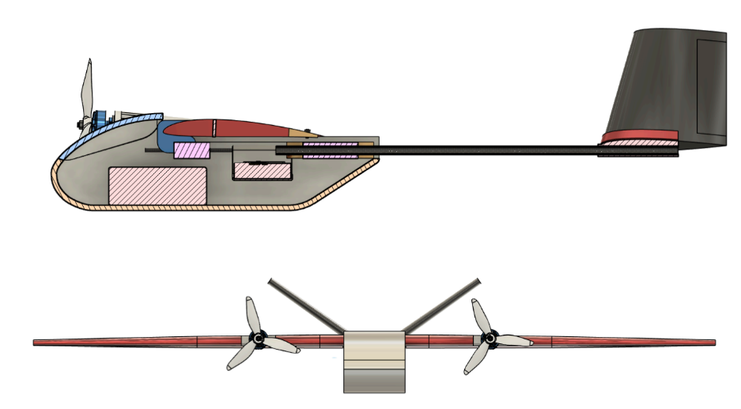
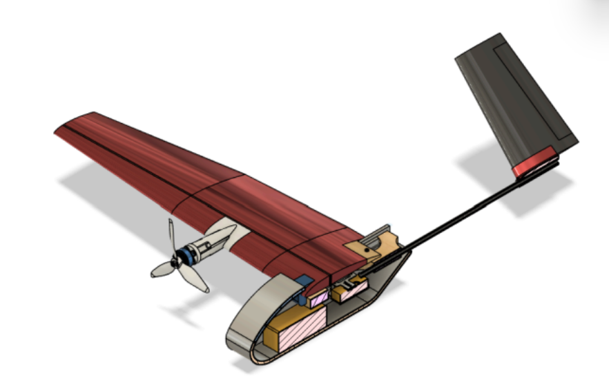
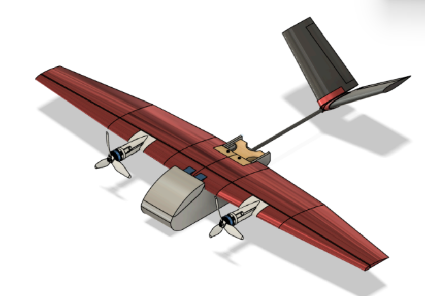

## Aerodynamic Analysis

Aerodynamic analysis was performed using **XFLR5** to support the aircraft configuration and evaluate its expected forward-flight performance.

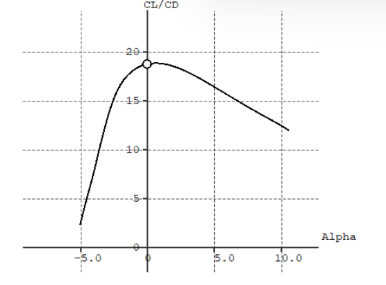
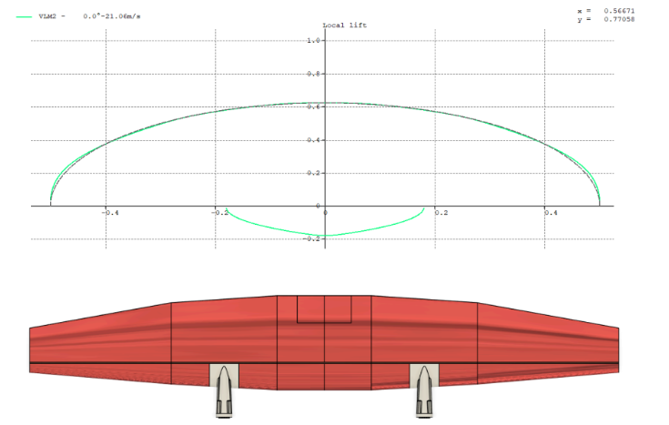

## Electronics & Flight Control

The aircraft used a **SpeedyBee F405 Wing** flight controller configured with **INAV**, together with drone motors, ESCs, digital servos, and LiPo-powered electronics.

The electronic and mechanical systems were integrated into the aircraft to enable both VTOL operation and the transition to forward flight.

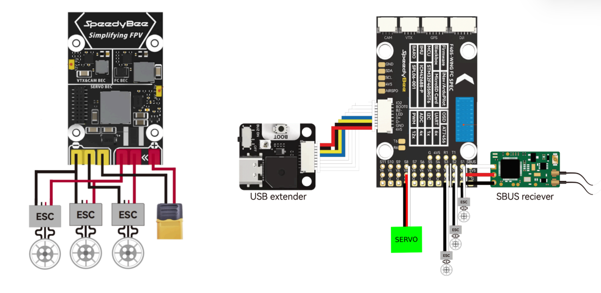
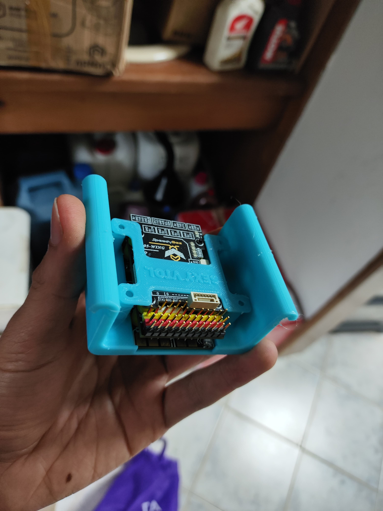
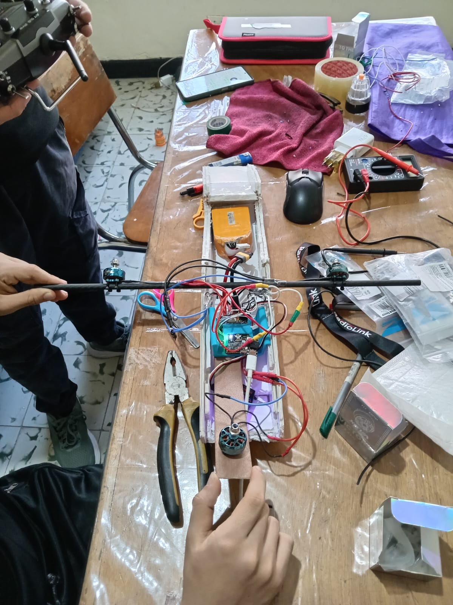

### First Iteration + Failed Attempt
[Failed Hover Attempt](https://youtube.com/shorts/JpqIHodHMZ8?feature=share)

[Succesful Hover Attempt](https://youtube.com/shorts/xSvRWv3706E?feature=share)

### Transition Test
[Hover to Forward Flight Transition Test](https://youtube.com/shorts/1u3-JSfAaXk?feature=share)

### Flight Test
[Full Flight Test](https://youtube.com/shorts/zZnBUJUz46I?feature=share)

This project was carried out by:
 - Santiago Firacative Alarcón
 - Gabriel David Ruiz Lubo
 - Schneider Alejandro Torres
 - Juan Pablo Rincón
 - Samuel Jiménez Arroyave

Universidad de Antioquia, Aerospace Engineering, Colombia.
